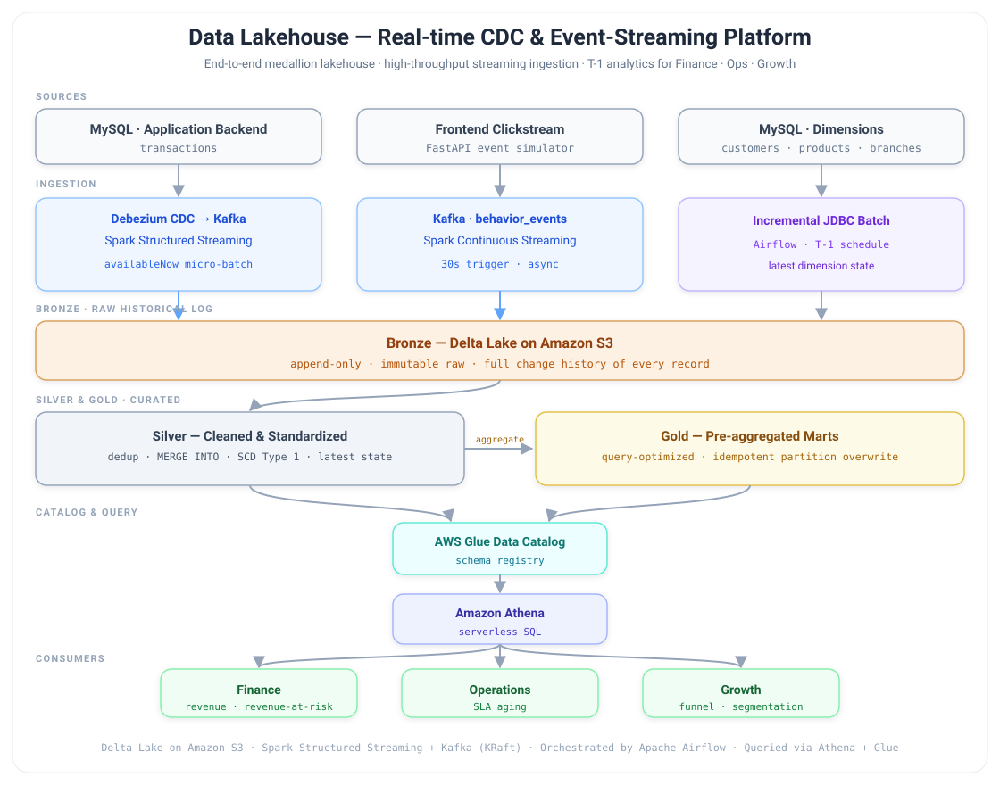

# Data Lakehouse — Real-time CDC & Event-Streaming Platform


End-to-end **data lakehouse** built on an omnichannel apparel-retail dataset, serving
**T-1 analytics** for Finance, Operations & Growth teams. The platform unifies two very
different data realities — *behavioral intent* (frontend clickstream) and *financial truth*
(backend ERP/sales) — into a single governed Delta Lake on AWS.

> Personal project. All code & documentation in English.

**Stack:** Kafka (KRaft, 3 brokers) · Debezium CDC · Spark Structured Streaming ·
Delta Lake · AWS (S3, Glue Data Catalog, Athena) · Apache Airflow · FastAPI (data simulator)

---

## 1. What this project demonstrates

| Capability | How it's implemented |
|---|---|
| **Three distinct ingestion paths** | CDC, async clickstream, incremental JDBC — all landing append-only in Bronze |
| **Change-history preservation** | Bronze is immutable; nothing is mutated or deleted, full audit trail kept |
| **Exactly-once / idempotent** | Idempotent Kafka producers + idempotent MERGE/backfill on the lake side |
| **Cost & latency tuning** | Micro-batch sizing, Z-ordering, partition pruning, optimizeWrite, Deletion Vectors |
| **Business-grade analytics** | Order-lifecycle, conversion funnel, customer segmentation marts |
| **In-pipeline data-quality gate** | Deequ Write-Audit-Publish on `silver.transactions` — anomaly + cross-table reconciliation + row-level quarantine; a bad batch never reaches prod |

---

## 2. Architecture



### The three ingestion paths

1. **Debezium CDC → transactions** — row-level changes from MySQL captured by Debezium,
   streamed through Kafka and drained by Spark Structured Streaming in `availableNow`
   micro-batch mode (`streaming_cdc_to_bronze.py`). Append-only, preserving the full
   change history of every order.
2. **Async Kafka clickstream** — user-behavior events generated by a FastAPI simulator,
   published by an idempotent producer with a local append-only **JSONL file fallback**
   (`clickstream_fallback.jsonl`) for Kafka outages — events are buffered, then auto-drained
   back into Kafka on recovery. Ingested via continuous streaming (`streaming_to_bronze.py`).
3. **Incremental JDBC batch** — dimensions (customers, products, branches, category)
   loaded T-1 from MySQL by Airflow-orchestrated Spark batch jobs.

---

## 3. Scale & load testing

Validated under simulated peak traffic:

| Path | Sustained throughput |
|---|---|
| Clickstream (end-to-end) | **~20K events/sec** |
| CDC change-events (micro-batch) | **~5M/hour (~1,400/sec)** |

---

## 4. Medallion modeling & reliability

| Layer | Role | Key techniques |
|---|---|---|
| **Bronze** | Immutable raw landing | Append-only, preserves raw JSON + `_kafka_offset` for reprocessing |
| **Silver** | Cleaned & conformed | Dedup, type parsing, **idempotent `MERGE INTO` (SCD Type 1)**, idempotent backfill for safe recovery |
| **Gold** | Business marts | Pre-aggregated, idempotent T-1 partition overwrite (`replaceWhere`) |

**Reliability guarantees:** exactly-once CDC via idempotent producers, JSONL fallback for
buffered recovery, and idempotent backfill jobs — the whole pipeline is safe to re-run.

**Parallel backfill:** the backfill DAG fans out independent Silver backfill jobs to run
**concurrently** via Airflow task parallelism (no inter-job dependency), reprocessing full
Bronze history quickly. Because each job is idempotent, the backfill is safe to re-trigger.

---

## 5. Data quality — Write-Audit-Publish gate

`silver.transactions` is guarded by a **Write-Audit-Publish (WAP)** quality gate built on
**Amazon Deequ / PyDeequ**: a bad batch is provably isolated and never reaches the published
table. It's a reusable framework in [`processing/dq/`](processing/dq/), wired into the daily
Silver DAG as four `spark-submit` phases.

| Phase | What it does |
|---|---|
| **Write** | Transformed + deduped batch written to an isolated **staging** path, partitioned by ingestion `run_date` — idempotent re-run overwrites the same partition |
| **Audit** | Deequ `VerificationSuite` — 6-dimension hard gate (completeness, validity, uniqueness-grain, consistency) + soft warnings + statistical **anomaly** checks (volume / completeness / mean / sum drift vs metric history) |
| **Reconcile** | Cross-table **accuracy** rules Deequ can't express single-table: header↔detail control-total (`Σ line_amount == order_total_amount`) + referential integrity (customer / branch FKs) |
| **Publish** | Only on pass — atomic Delta `MERGE` (newer-wins guard) into prod, then CDF / Deletion Vectors / CHECK constraints / Glue registration |

**Two failure classes, two reactions.** A *data* failure (constraint breach) raises a no-retry
`AirflowFailException` (exit `42` / `DQ_GATE_FAILED` marker), auto-skips publish, and fires an
alert; an *infra* failure (OOM, S3 auth) retries normally. That split is the whole point of the gate.

**Forensics, not just a ratio.** Deequ reports *what fraction* violated each rule, not *which
rows*. The gate reuses the exact rule predicates to tag every offending row with a
`failure_reason` and lands them in a **quarantine** Delta table, plus a compact per-run JSON
summary (`dq/status/<run_date>.json`) the Airflow alert renders straight into email — no
log-diving. Rule definitions live in **one place** ([`checks.py`](processing/dq/checks.py)
`TRANSACTION_ROW_RULES`) and drive both the Deequ check and the row-level quarantine, so they
can't drift apart.

**Evidence & history.** Every run appends per-constraint results to an **evidence** Delta table
and metric values to a `FileSystemMetricsRepository` JSON — the latter is the baseline the
anomaly checks read, moving the gate from "rules I wrote" (known-knowns) toward "drift I didn't"
(unknown-unknowns). Lake layout: `dq/{staging,quarantine,evidence,metrics,status}/…`.

Validated locally on simulated good + fault-injected batches
([`notebooks/02_dq_gate_test.ipynb`](notebooks/02_dq_gate_test.ipynb)); the Deequ jar + PyDeequ
are baked into `Dockerfile.spark`.

---

## 6. Spark cost / latency tuning

| Concern | Technique |
|---|---|
| Throughput vs latency | Micro-batch sizing — `maxOffsetsPerTrigger`, `minPartitions` |
| Read efficiency | Z-ordering + partition pruning to minimize data scanned |
| Small files | `optimizeWrite` on write + off-peak compaction |
| Update/delete cost | **Deletion Vectors** to skip full-file rewrites |

---

## 7. Analytics layer

Built on top of Gold to answer real business questions:

| Mart | Business question |
|---|---|
| **9-status order-lifecycle model** | Where is *revenue-at-risk* across the fulfillment chain? |
| **14-step conversion funnel** | Where do users drop off from discovery → cart → checkout? |
| **Recency-based segmentation** | Customer lifecycle: NOU / retention / resurrected |

---

## 8. Quick start

```bash
# 1. Configure AWS credentials
cp .env.example .env        # fill in AWS_ACCESS_KEY_ID, AWS_SECRET_ACCESS_KEY, AWS_REGION, S3_BUCKET

# 2. Start the full stack
docker compose up --build

# 3. First run only — create Kafka topics & register Debezium connector
docker exec python-producer python scripts/setup_topics.py

# 4. Verify the simulator
curl http://localhost:8000/health
```

### Service URLs

| Service | URL |
|---|---|
| Kafka UI | http://localhost:8080 |
| Spark Master | http://localhost:8081 |
| Spark App (Bronze) | http://localhost:4040 |
| Airflow | http://localhost:8085 |
| Jupyter Lab | http://localhost:8888 |
| data-simulator | http://localhost:8000/docs |

---

## 9. Repository layout

| Directory | Contents |
|---|---|
| `ingestion/` | FastAPI simulator + idempotent Kafka producer (with JSONL fallback) |
| `processing/` | Spark jobs — streaming (clickstream + CDC) and batch (Bronze→Silver→Gold) |
| `processing/dq/` | Reusable Deequ **Write-Audit-Publish** DQ framework — checks/rules, WAP engine, reconcile, anomaly, quarantine, evidence/metrics |
| `orchestration/` | Airflow DAGs (CDC, batch SQL, Silver, Gold, backfill, maintenance) |
| `infra/` | MySQL DDL/seed, Airflow & Debezium connector config |
| `tests/` | PySpark unit tests — Silver `transform()`s + DQ gate/quarantine (`tests/silver/`, one file per job) |

---

## 10. CI & testing

GitHub Actions runs a four-job pipeline on every push / PR (badge at the top):

| Job | Runs | What it checks |
|---|---|---|
| **quality** | ruff lint + `ruff format --check` + mypy | Fast gate, no JVM — fails early & cheap |
| **security** | `pip-audit` (dependency CVEs) + `gitleaks` (secret scan) | Blocks vulnerable deps & leaked AWS/MySQL creds |
| **test** | Java 17 + `pytest --cov` (coverage gate) | PySpark unit tests on Silver `transform()`s |
| **docker-build** | Buildx build of `Dockerfile` + `Dockerfile.spark` | Proves the runtime images actually build |

### Pass / fail condition per check

| Stage | Check | Passes when | Fails when |
|---|---|---|---|
| quality | `ruff check` | No lint errors (E/F/I/UP/B/SIM rules in `pyproject.toml`) | Any rule violation in `tests/` or `JOBS` |
| quality | `ruff format --check` | `tests/` already matches ruff formatting | Any file would be reformatted |
| quality | `mypy` | No type errors on `tests/` + `JOBS` | Any type error (missing stubs are ignored) |
| security | `pip-audit` | No CVE outside the accepted-risk allowlist | A *new* CVE in `requirements*.txt` |
| security | `gitleaks` | No secret found in the full git history | Any AWS/MySQL key/secret pattern detected |
| test | `pytest` | All test cases pass | Any test fails or errors |
| test | coverage gate | Total coverage ≥ `fail_under` (28%) | Coverage drops below the floor |
| docker-build | buildx | Both `Dockerfile` + `Dockerfile.spark` build | Any image fails to build |

`quality` and `security` run in parallel (both JVM-free); `test` and `docker-build` run once
`quality` is green. Two gates beyond pass/fail tests:

- **Coverage gate** — `fail_under` in `pyproject.toml` (`[tool.coverage.report]`) fails the build
  if coverage *regresses*. It's a ratchet floor, not a target (totals include each job's untested
  `main()` I/O half), so raise it as tests are added.
- **Security gate** — `pip-audit` blocks any *new* dependency CVE; an accepted-risk allowlist
  (documented in the `Makefile` `audit` target) keeps known-deferred advisories from going red.
  `gitleaks` scans full git history so a committed secret fails CI even if later removed.

**Testable by design.** Each Silver job splits a **pure `transform(df) → df`** (no Spark
session, no S3/Kafka I/O) from `main()` (which owns all I/O). Tests build in-memory rows and
assert on the transform alone — dedup/SCD1, Smart-Key generation, metadata flattening,
CDC-envelope parsing — with no cluster or AWS access. A session-scoped Spark fixture starts
the JVM once for the whole suite.

**Low-maintenance scoping.** Lint/type-check the refactored jobs only (legacy jobs keep their
compact style) without hand-listing files everywhere:
- `Makefile` `JOBS` is the single source for ruff + mypy; `ci.yml` calls `make` (no duplicated list).
- Coverage uses a `batch_silver_*.py` **glob** — only imported jobs are measured, so backfill/CDC jobs drop out automatically.
- pytest runs in `--import-mode=importlib` so same-named files across layers (`silver/` vs `gold/`) don't collide.

```bash
make install   # pip install -r requirements-dev.txt
make ci        # lint + format check + mypy + pip-audit + pytest --cov  (mirrors CI gates)
make build     # build both Docker images locally (needs a Docker daemon; CI does this too)
```
